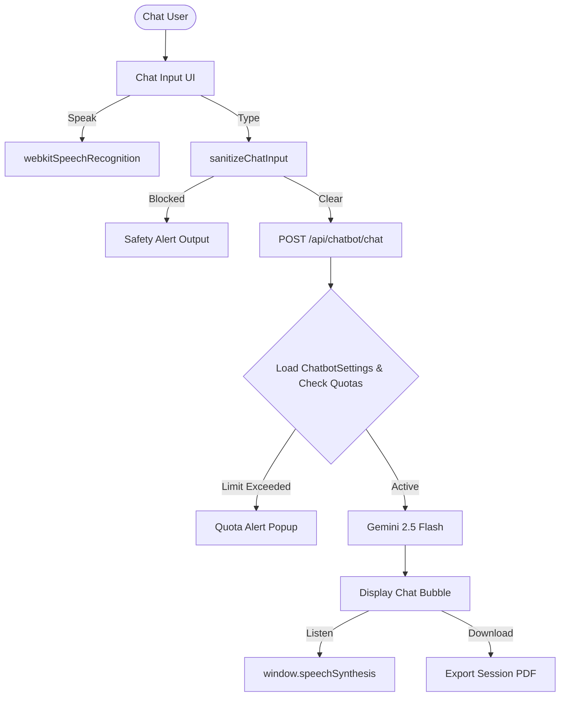

# The Ultimate Implementation Plan - MOCKEA Premium AI Global Chatbot

This comprehensive implementation plan defines the complete architecture, security features, and premium functionalities for the **MOCKEA Global AI Chatbot & Site Guide**. By utilizing high-performance native Web APIs, this chatbot requires **zero heavy external dependencies** and maintains complete code safety.

---

## 🌟 Full Feature Map


---

## Proposed Changes

### 1. Dynamic Admin Configurations (Database & Routes)

#### [NEW] [chatbotSettings.js](file:///g:/project/MOCKEA/backend/src/model/chatbotSettings.js)
*   Create a schema to store chatbot limits and configurations globally:
    ```javascript
    import mongoose from "mongoose";

    const chatbotSettingsSchema = new mongoose.Schema({
      isActive: { type: Boolean, default: true },
      welcomeMessage: { 
        type: String, 
        default: "Hello! I'm your MOCKEA IELTS Tutor & Support Assistant. How can I help you today?" 
      },
      guestLimit: { type: Number, default: 5 },
      basicLimit: { type: Number, default: 20 },
      proLimit: { type: Number, default: 100 },
      eliteLimit: { type: Number, default: 999999 }
    }, { timestamps: true });

    const ChatbotSettings = mongoose.model("ChatbotSettings", chatbotSettingsSchema);
    export default ChatbotSettings;
    ```

#### [NEW] [chatbot.controller.js](file:///g:/project/MOCKEA/backend/src/controllers/chatbot.controller.js)
*   **`getChatbotSettings`:** Retrieve active settings or create default settings if empty.
*   **`updateChatbotSettings`:** Admin-only route to save updated limits, greetings, or toggle active state.
*   **`chatWithAI`:**
    *   Validate inputs, check the user's active tier, and reset daily usage counts if a new calendar day has started.
    *   If active message counts exceed the dynamic tier limit from MongoDB, return `429 Limit Exceeded`.

#### [NEW] [chatbot.route.js](file:///g:/project/MOCKEA/backend/src/routes/chatbot.route.js)
*   Expose endpoints for chat inputs and admin configurations.

---

### 2. Multi-Layered Anti-Script Injection Security

#### Layer A: Backend Code & Script Sanitizer
*   **[NEW] [sanitizeInput.js](file:///g:/project/MOCKEA/backend/src/utils/sanitizeInput.js):**
    *   Checks for script injections (`<script>`, `onerror=`, `onload=`, etc.).
    *   Blocks common programming structures (`function`, `const`, `let`, `import`, `require`, `def`, `class`) to prevent code pushes.
    *   Escapes all HTML characters. Rejects suspicious queries with a `400 Security Alert`.

#### Layer B: Prompt Injection Shield (LLM level)
*   Configure backend instructions to block code outputs, prevent override commands (like *"ignore previous instructions"*), and restrict responses to supportive tutor details.

#### Layer C: Frontend Display Escaping
*   Convert HTML special characters globally inside bubble components to render tags safely as inert text.

---

### 3. Premium Interactive Frontend Upgrades

#### [NEW] [StudyBuddyChatbot.jsx](file:///g:/project/MOCKEA/frontend/src/components/Common/StudyBuddyChatbot.jsx)
A floating toggle widget globally accessible inside `HomeLayout.jsx` and `DashboardLayout.jsx`. It includes:

#### 🔊 Feature A: AI Vocal Pronunciation (Text-to-Speech)
*   Each AI message bubble displays a Speaker icon.
*   Clicking the icon triggers the **Web Speech Synthesis API**:
    ```javascript
    const speakText = (text) => {
      window.speechSynthesis.cancel(); // stop previous speech
      const cleanText = text.replace(/[*#_`]/g, ""); // remove markdown
      const utterance = new SpeechSynthesisUtterance(cleanText);
      utterance.voice = window.speechSynthesis.getVoices().find(v => v.lang.includes("en-GB") || v.lang.includes("en-US"));
      utterance.rate = 0.95; // professional pedagogical speed
      window.speechSynthesis.speak(utterance);
    };
    ```

#### 🎙️ Feature B: Microphone Real-Time Input (Speech-to-Text)
*   An interactive microphone icon is built into the input bar.
*   Clicking it initializes **Web Speech Recognition (`webkitSpeechRecognition`)** to transcribe student answers in real-time, showing a pulsing recording card.

#### 🎛️ Feature C: Tutor Mode Toggles (Personality Modes)
*   A selection tab in the chatbot header enables users to toggle modes:
    1.  **IELTS Tutor:** Warm study partner, tests vocabulary, and explains grammar rules.
    2.  **IELTS Examiner:** Strict examiner. Initiates standard Speaking cue-card prompts and conducts a timed interview.
    3.  **Site Assistant:** Answers questions about MOCKEA pages, features, full mock tests, anti-cheat regulations, and support emails.

#### 📄 Feature D: Chat Session Exporter
*   A header download button compiled with a client-side layout compiler. Automatically creates a beautifully organized text review file containing the dialogue transcripts, AI grammar notes, and corrections.

---

### 4. Admin Management Dashboard

#### [MODIFY] [AdminSettings.jsx](file:///g:/project/MOCKEA/frontend/src/components/Dashboard/Admin Dashboard/AdminSettings.jsx)
We will expand the Admin Settings dashboard with a dedicated card containing:
*   Global Chatbot Toggle switch.
*   Welcome message input box.
*   Daily message limit input fields for Guest, Basic, Pro, and Elite packages.
*   Save action syncing limits instantly to the database.

---

## Verification Plan

### Security & Functional Testing
1.  **XSS / Code Injection:**
    *   Attempt to type `<script>alert('inject')</script>` or `function test() {}`. Verify the UI or API rejects the query with a clean safety error block.
2.  **Web Speech (Text-to-Speech & Speech-to-Text):**
    *   Record voice and verify speech compiles directly into the input bar.
    *   Tap speaker icon and confirm a natural vocal speech plays back.
3.  **Dynamic Limits:**
    *   Adjust a tier limit in Admin Panel. Confirm the backend enforces the new dynamic limit on the active tier immediately.
